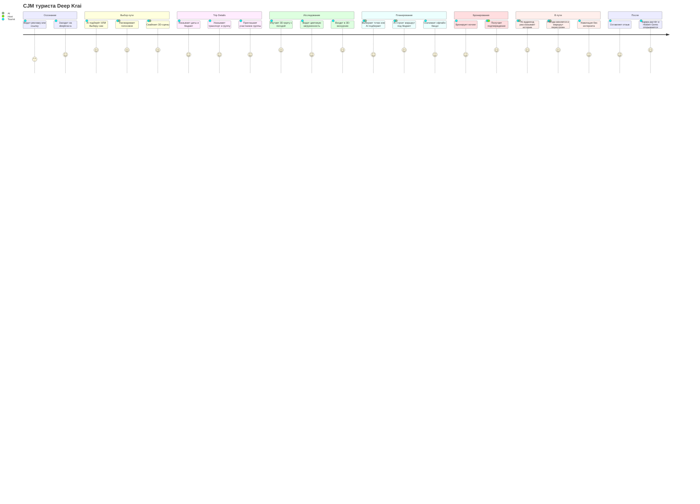
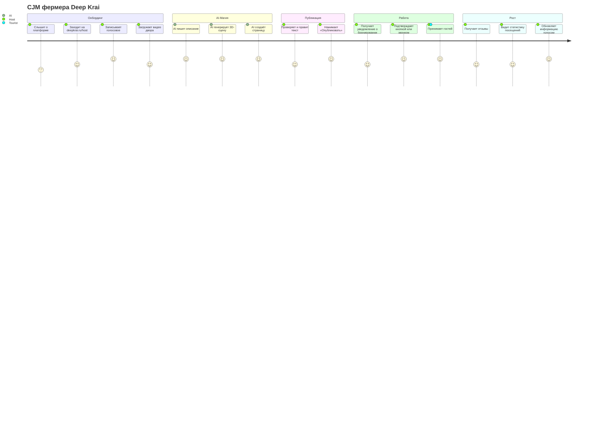

# 🌿 DEEP KRAI — Global Design Document (GDD)

> **Не ищи маршрут. Позволь краю почувствовать тебя.**

---

## 1. Обзор продукта

### 1.1 Проблема

Краснодарский край — это не только пляжи Сочи и канатки Красной Поляны. Существует огромный, невидимый слой **камерных мест**: крафтовые винодельни, фермы с козьим сыром, горные тропы, гастрономические точки, фестивали, о которых узнают только «от знакомых знакомых».

Одновременно **малый бизнес** (фермеры, пасечники, владельцы гостевых домов) не могут до путешественников достучаться — у них нет навыков цифрового маркетинга, профессиональных фото и CRM-систем.

**Нет моста** между теми, кто ищет настоящее, и теми, кто это настоящее создаёт.

### 1.2 Решение

**Deep Krai** — PWA-платформа пространственного туризма (Spatial Tourism), которая:

1. **Понимает туриста** через мультимодальный ИИ (голос + эмоциональные 3D-свайпы), а не через скучные фильтры.
2. **Погружает до поездки** через фотореалистичные 3D-слепки локаций (Gaussian Splatting), интерактивную 3D-карту с live-погодой и AI-сторителлинг.
3. **Убирает барьеры для бизнеса** через Zero-UI онбординг: фермер записывает одно голосовое и кидает видео — ИИ сам создаёт страницу, пишет описание и открывает бронирование.
4. **Ведёт в пути** — AI-аудиогид, динамическая перестройка маршрута по погоде, полный офлайн-режим в горах.

### 1.3 Целевая аудитория

| Сегмент                             | Описание                                           | Боль                                             |
| ----------------------------------- | -------------------------------------------------- | ------------------------------------------------ |
| **Новые путешественники** (25-40)   | Устали от «конвейерного» туризма, ищут «настоящее» | Не знают, что искать, и боятся «попасть не туда» |
| **Активные искатели** (30-50)       | Знают, что есть скрытые места, но не могут найти   | Нет агрегатора, информация разрозненная          |
| **Фермеры / малый бизнес** (40-65+) | Создают уникальный продукт, но невидимы            | Нет цифровых навыков, не умеют продвигаться      |
| **Минтуризма / Администрация края** | Нужна аналитика и развитие территорий              | Нет данных о скрытом спросе и проблемных зонах   |

### 1.4 Elevator Pitch (30 секунд для жюри)

> _«Представьте: вы говорите телефону "Я устал, хочу тишины и хорошего вина" — и через 10 секунд перед вами фотореалистичная 3D-экскурсия по частной винодельне в станице, о которой не знает даже Google. А фермер на другом конце провода не настраивал никакого сайта — он просто записал голосовое в мессенджер. Это Deep Krai — мост между путешественниками и скрытым Краснодарским краем, построенный на мультимодальном ИИ и Spatial Computing.»_

---

## 2. Системная архитектура

### 2.1 Общая схема

```mermaid
graph TB
    subgraph "Frontend (Nuxt 3 + TresJS)"
        A[PWA App] --> B[3D Globe Map]
        A --> C[Vibe Profiling UI]
        A --> D[Gaussian Splatting Viewer]
        A --> E[AI Audio Player]
        A --> F[B2G Dashboard]
    end

    subgraph "API Gateway (Golang)"
        G[HTTP/WS Router] --> H[Auth Middleware]
        G --> I[Rate Limiter]
    end

    subgraph "Core Services (Golang)"
        J[Profile Service]
        K[Routing Service]
        L[Location Service]
        M[Booking Service]
        N[Onboarding Service]
        O[Analytics Service]
        P[Media Service]
        Q[Notification Service]
        R[Storytelling Service]
    end

    subgraph "AI Pipeline (Golang + External APIs)"
        S[Whisper STT]
        T[LLM Engine - GPT-4o/Claude]
        U[Embedding Generator]
        V[Sentiment Analyzer]
        W[Luma AI - 3D Splatting]
        X[ElevenLabs TTS]
    end

    subgraph "Data Layer"
        DB1[(PostgreSQL + PostGIS)]
        DB2[(Qdrant - Vectors)]
        DB3[(Neo4j - Graphs)]
        DB4[(ClickHouse - Analytics)]
        DB5[(Redis - Cache/PubSub)]
        DB6[(MinIO - Object Storage)]
    end

    A --> G
    G --> J & K & L & M & N & O & P & Q & R
    J --> S & T & U & V
    N --> S & T & W
    R --> T & X
    K --> DB3 & DB5
    J --> DB1 & DB2
    L --> DB1 & DB6
    M --> DB1 & DB5
    O --> DB4
    P --> DB6 & W
    Q --> DB5
```



### 2.2 Polyglot Persistence — Слой баз данных

| БД                       | Назначение                      | Что хранит                                                                             | Почему именно она                                                                  |
| ------------------------ | ------------------------------- | -------------------------------------------------------------------------------------- | ---------------------------------------------------------------------------------- |
| **PostgreSQL + PostGIS** | Core транзакционная БД          | Пользователи, локации (с GEO), бронирования, слоты, отзывы, финансовые транзакции      | ACID, пространственные запросы (ST_DWithin, ST_Contains), зрелая экосистема        |
| **Qdrant**               | Векторная БД                    | Vibe-эмбеддинги пользователей, vibe-эмбеддинги локаций, эмбеддинги описаний            | Cosine similarity за 2ms, фильтрация по метаданным, горизонтальное масштабирование |
| **Neo4j**                | Графовая БД                     | Граф дорог/маршрутов, граф доверия (Hidden Gems), связи пользователь↔локация           | Dijkstra/A\* «из коробки», динамическое изменение весов рёбер, Cypher-запросы      |
| **ClickHouse**           | Колоночная аналитическая БД     | Телеметрия (свайпы, клики, GPS-треки), агрегаты для B2G-дашборда, тепловые карты       | 100M+ строк/сек на агрегацию, идеальна для аналитики                               |
| **Redis**                | Кэш + Message Broker            | Сессии, кэш API погоды, PubSub для WebSocket-уведомлений, очереди задач                | In-memory < 1ms, Pub/Sub для реал-тайма, Streams для очередей                      |
| **MinIO**                | Object Storage (S3-совместимый) | .splat файлы (3D-сцены), аудиофайлы (ElevenLabs), сырые видео от фермеров, изображения | S3 API, self-hosted, огромные файлы без нагрузки на PostgreSQL                     |

### 2.3 Стек технологий

| Слой                    | Технология                               |
| ----------------------- | ---------------------------------------- |
| **Frontend Framework**  | Nuxt 3 (SSR + PWA)                       |
| **UI**                  | Tailwind CSS                             |
| **3D Engine**           | TresJS (Three.js для Vue) / Mapbox GL JS |
| **3D Splatting Viewer** | gsplat.js / Luma WebGL Library           |
| **Backend Language**    | Golang 1.22+                             |
| **API Framework**       | Chi / Fiber / Echo                       |
| **AI: Speech-to-Text**  | OpenAI Whisper API                       |
| **AI: LLM**             | GPT-4o / Claude 3.5 (через API)          |
| **AI: Embeddings**      | text-embedding-3-large (OpenAI)          |
| **AI: Sentiment**       | Custom pipeline (Whisper features + LLM) |
| **AI: 3D Generation**   | Luma AI API (Gaussian Splatting)         |
| **AI: Text-to-Speech**  | ElevenLabs API                           |
| **Telephony**           | Voximplant / Zadarma API                 |
| **Weather API**         | OpenWeatherMap / Яндекс.Погода           |
| **Containerization**    | Docker + Docker Compose                  |
| **Reverse Proxy**       | Nginx / Caddy                            |

---

## 3. Фичи — Полная спецификация

---

### 🧠 Фича 1: Умное планирование поездки (Гибридный подход)

**Цель**: Дать туристу **два пути** к маршруту — WOW-профилирование через ИИ или прямой ручной выбор — и собрать все практические данные для реального маршрута.

#### Точка входа: Выбери свой путь

При первом входе юзер видит экран с двумя CTA:
- **[🎤 ИИ подберёт]** → Вайб-профилирование (Способ А + Б)
- **[🗺 Выберу сам]** → Сразу на 3D-карту с каталогом

Оба пути ведут к обязательному шагу **Trip Details**.

#### Способ А: Голосовой Sentiment-анализ (Voice-to-Vibe)

**User Flow:**

1. Пользователь открывает страницу профилирования
2. Видит большую анимированную кнопку микрофона с текстом: _«Расскажи, чего хочешь. Без фильтров.»_
3. Нажимает и держит — идёт запись (Web Audio API, визуализация звуковой волны)
4. Отпускает — аудио отправляется на бэкенд
5. На экране анимация «ИИ думает» (частицы собираются в форму)
6. Через 3-5 секунд появляется визуализация «вайб-профиля» — абстрактный радар/граф с осями:
   - 🔇 Уединение ↔ Компания 🎉
   - 🧘 Релакс ↔ Адреналин ⚡
   - 🍷 Гастрономия ↔ Природа 🌿
   - 🏛 Культура ↔ Приключения 🗺

**Техническая реализация (Backend):**

1. Аудио (WebM/OGG) → отправляется на Golang-сервис `profile-service`
2. `profile-service` → отправляет в **Whisper API** → получает транскрипцию
3. Транскрипция → **GPT-4o** с системным промптом:
   ```
   Ты — AI-профайлер туристической платформы Deep Krai. Проанализируй текст пользователя
   и определи его эмоциональное состояние и предпочтения. Верни JSON:
   {
     "stress_level": 0.0-1.0,
     "solitude_vs_social": -1.0 to 1.0,
     "relax_vs_adrenaline": -1.0 to 1.0,
     "gastro_vs_nature": -1.0 to 1.0,
     "culture_vs_adventure": -1.0 to 1.0,
     "extracted_tags": ["тишина", "вино", "горы"],
     "vibe_summary": "Одно предложение о настроении"
   }
   ```
4. JSON-результат → **Embedding Generator** (text-embedding-3-large) → вектор 3072d
5. Вектор → сохраняется в **Qdrant** (коллекция `user_vibes`) с payload (теги, оси, timestamp)
6. Vibe-профиль → возвращается на фронт для визуализации

#### Способ Б: Эмоциональный 3D-свайп

**User Flow:**

1. После или вместо голоса — юзер попадает на экран со «сценами»
2. Каждая сцена — WebGL-миниатюра с пространственным звуком:
   - 🔥 Костёр в тишине (треск дров, сверчки)
   - 🍷 Винный погреб (звон бокалов, приглушённый джаз)
   - 🏔 Горная тропа (ветер, птицы, хруст камней)
   - 🌊 Уединённый берег (шёпот волн)
   - 🎪 Деревенский фестиваль (музыка, смех, запах жарки)
   - 🐐 Ферма на рассвете (блеяние коз, звон ведра)
   - 🏕 Палатка у реки (шум воды, молнии вдалеке)
   - 🏡 Старый дом с историей (скрип двери, тиканье часов)
3. Свайп вправо = «Хочу это ощущение», влево = «Не моё» (Tinder-механика)
4. Каждый свайп корректирует вектор в Qdrant (дельта-обновление)
5. После 6-8 свайпов — система уверена в профиле, переходит к результатам

**Техническая реализация (Backend):**

1. Каждая сцена имеет предвычисленный vibe-вектор в Qdrant
2. При свайпе вправо → вектор юзера сдвигается к вектору сцены (взвешенное среднее)
3. При свайпе влево → вектор юзера отдаляется
4. API endpoint: `POST /api/v1/profile/swipe` → `{ scene_id, direction }`
5. После финального свайпа: `POST /api/v1/profile/finalize` → запускает поиск Top-N локаций в Qdrant

#### Обязательный шаг: Trip Details (Детали поездки)

Независимо от выбранного пути (ИИ / вручную), юзер **обязан** заполнить:

**User Flow:**

1. После вайб-профилирования ИЛИ сразу (если «Выберу сам») — экран «Расскажи о поездке»
2. Компактная форма (5 полей, заполняется за 30 секунд):
   - 📅 **Даты**: диапазон-пикер (когда едем — когда возвращаемся)
   - 💰 **Бюджет**: ползунок (эконом / комфорт / premium) или точная сумма в ₽
   - 🚗 **Транспорт**: авто / общественный / пешком / велосипед
   - 👥 **Группа**: сколько человек + состав (взрослые, дети, возраст детей)
   - 🏨 **Формат**: с ночёвками / одним днём / многодневный маршрут
3. Нажимает «Дальше» → ИИ получает ВСЕ данные: и вайб, и логистику

**Техническая реализация (Backend):**

1. `POST /api/v1/trips` → создаёт объект поездки:
   ```json
   {
     "date_from": "2026-04-10",
     "date_to": "2026-04-13",
     "budget_rub": 50000,
     "budget_tier": "comfort",
     "transport": "car",
     "group_size": 4,
     "group_composition": {
       "adults": 2,
       "children": [{ "age": 8 }, { "age": 12 }]
     },
     "format": "multi_day",
     "vibe_vector_id": "qdrant-uuid-or-null"
   }
   ```
2. ИИ-роутинг использует **все** параметры:
   - Бюджет → фильтрует локации по price_per_night × кол-во ночей
   - Транспорт → Neo4j считает время с учётом типа (авто быстрее, пешком дольше)
   - Дети → фильтрует недетские места, добавляет зоопарки/парки
   - Даты → проверяет доступность слотов бронирования
   - Формат → определяет кол-во точек и расстояния между ними

#### Групповое планирование (Компания / Семья)

**Сценарий**: Батя, жена и двое детей. Или 5 друзей. У каждого свои предпочтения.

**User Flow:**

1. Создатель поездки заполняет Trip Details и указывает кол-во участников
2. Получает **ссылку-приглашение** (или QR-код)
3. Каждый участник по ссылке может:
   - Быстро пройти мини-профилирование (голосовое или 3 свайпа)
   - Или просто выбрать теги вручную (вино, горы, экстрим, дети, культура...)
4. ИИ **мёржит** все профили группы:
   - Находит общие пересечения (все хотят природу → ок)
   - Балансирует конфликты (папа хочет пиво, дети — зоопарк → маршрут включает оба)
   - Генерирует «расписание компромиссов»: утром ферма (для жены), днём зоопарк (для детей), вечером дегустация (для папы)
5. Результат: **один маршрут**, где каждый участник получает что-то своё

**Техническая реализация (Backend):**

1. `POST /api/v1/trips/{id}/invite` → генерирует invite-токен (UUID, TTL 72 часа)
2. `POST /api/v1/trips/{id}/join` → участник присоединяется + отправляет свой мини-профиль
3. Таблица `trip_members` хранит vibe-вектор каждого участника
4. `POST /api/v1/trips/{id}/build-route` → routing-service:
   - Загружает все вектора участников из Qdrant
   - Вычисляет **merged vibe vector** (взвешенное среднее + учёт детей)
   - LLM анализирует конфликты и генерирует тайм-менеджмент
   - Neo4j строит маршрут с учётом бюджета, транспорта, дат
   - Возвращает маршрут с пометками: «🧒 для детей», «🍷 для взрослых»

#### Результат

После заполнения Trip Details (+ групповые профили, если есть) пользователь видит:

- Свой «вайб-паспорт» (если проходил профилирование) ИЛИ сразу карту
- Top-5 подобранных локаций с 3D-превью (подстроены под бюджет, даты, группу)
- Кнопку «Собрать маршрут» → переход к Фиче 2 (3D-карта)
- Если группа: сводку «Что хотят участники» и как ИИ это объединил

---

### 🌍 Фича 2: Интерактивная 3D-карта Краснодарского края

**Цель**: Заменить плоские 2D-карты на иммерсивный 3D-глобус/макет, где погода соответствует реальности.

#### Внешний вид и взаимодействие

**Визуал:**

- Low-poly стилизованная 3D-модель рельефа Краснодарского края
- Горы, побережье, равнины — всё передано через геометрию
- Карта парит в пространстве, можно вращать (orbit controls), зумить
- Точки локаций — светящиеся маркеры с **цветовой маркировкой загруженности**:
  - 🔴 **Красный** — высокая загруженность (много туристов круглый год)
  - 🟡 **Жёлтый** — сезонная загруженность (в сезон много, вне — мало)
  - 🟢 **Зелёный** — скрытое место (редко посещается, Hidden Gem)
  - UI-переключатель: «Показать по загруженности» / «Показать по категории»
- Маршрут — неоновый сплайн-путь, который анимированно прокладывается

**Live-погода (с возможностью отключить):**

- ☀️ Солнечно → тёплый directional light, lens flare
- 🌧 Дождь → WebGL-партиклы капель над регионом
- ⛅ Облачно → объёмные low-poly облака
- 🌫 Туман → volumetric fog шейдер
- ❄️ Снег → белые партиклы
- 🌅 Время суток → меняется освещение и skybox по реальному времени региона
- UI-панель с тумблерами: [☁️ Облака] [🌧 Дождь] [🌫 Туман] [🔊 Звуки] — каждый можно вкл/выкл

**User Flow:**

1. После профилирования/Trip Details — юзер видит 3D-карту
2. **Режим «ИИ подобрал»**: подсвечены рекомендованные точки (пульсируют), остальные приглушены
3. **Режим «Выберу сам»**: все точки видны, окрашены по загруженности (🔴🟡🟢)
4. Наводит на точку — всплывает tooltip: название, краткое описание, цена, загруженность
5. Кликает — открывается карточка локации (сайдбар с 3D-превью через Splatting)
6. Может добавить несколько точек в маршрут вручную ИЛИ нажать «🤖 ИИ, собери маршрут»
7. ИИ строит маршрут с учётом Trip Details (бюджет, даты, транспорт, группа)
8. Нажимает «Поехали» → маршрут сохраняется, доступно бронирование

**Техническая реализация (Backend):**

1. Endpoint: `GET /api/v1/map/locations?bbox=...&vibeVector=...` → возвращает локации в области видимости, отсортированные по близости к vibe-вектору
2. Endpoint: `GET /api/v1/weather/region` → кэшированные (Redis, TTL 10min) данные с OpenWeatherMap по ключевым точкам Кубани (Сочи, Краснодар, Горячий Ключ, Анапа, Геленджик, горные точки)
3. Endpoint: `POST /api/v1/route/build` → принимает массив location_id, запускает Neo4j Dijkstra для оптимального маршрута, возвращает GeoJSON polyline + time estimates
4. WebSocket: `/ws/v1/weather` → пушит обновления погоды каждые 10 минут

---

### 🧊 Фича 3: Immersive 3D-экскурсии (Gaussian Splatting)

**Цель**: Фотореалистичное 3D-погружение в локацию до поездки.

#### Как это работает для туриста

**User Flow:**

1. На карточке локации — кнопка «🧊 Войти в 3D»
2. Открывается полноэкранный WebGL-плеер
3. Юзер видит фотореалистичный 3D-слепок двора фермера / винного погреба / горной тропы
4. Может вращать камеру, приближать, «ходить» по сцене
5. В 3D-сцене есть интерактивные hotspot-точки:
   - Метка на козе → tooltip: «Козья ферма, 12 коз альпийской породы»
   - Метка на столе → tooltip: «Здесь проходят дегустации каждую субботу»
6. Пространственный звук (3D Audio): поворачиваешь камеру к мангалу — слышишь треск, к реке — шум воды

**Техническая реализация (Backend):**

1. Фермер загружает видео → сохраняется в MinIO
2. `media-service` отправляет задачу в Luma AI API (или аналог)
3. Luma возвращает .ply/.splat файл → сохраняется в MinIO
4. Endpoint: `GET /api/v1/locations/{id}/splat` → возвращает signed URL на .splat в MinIO
5. Фронтенд загружает и рендерит через gsplat.js / Luma WebGL lib

---

### 🚗 Фича 4: AI Live Routing & Storytelling

**Цель**: ИИ ведёт туриста в пути, перестраивает маршрут по погоде, рассказывает легенды.

#### Динамический роутинг

**User Flow:**

1. Турист в пути, приложение открыто (PWA на телефоне)
2. ИИ мониторит погоду по точкам маршрута (каждые 5 минут)
3. API погоды возвращает: «Гроза через 2 часа в горах»
4. Golang routing-service пересчитывает граф в Neo4j (вес ребра горного участка → +∞)
5. Находит альтернативный маршрут через винный погреб
6. WebSocket-пуш на телефон:
   > _«🌧 Тропу может размыть через 2 часа. Я перестроил маршрут — по пути уютный винный погреб "Долина Лефкадия". Хочешь заглянуть?»_
7. Юзер нажимает «Да» → маршрут обновляется → навигация перестраивается

**Техническая реализация (Backend):**

1. Cron-job каждые 5 минут: для каждого активного маршрута проверяет погоду по точкам
2. Если условие «опасно» → routing-service обновляет веса в Neo4j
3. Запускает A\*/Dijkstra для нового маршрута
4. LLM генерирует человечное уведомление (не сухой alert, а дружелюбный текст)
5. Пуш через Redis PubSub → WebSocket → фронт

#### AI-Аудиогид (Storytelling On-the-Fly)

**User Flow:**

1. Турист едет в машине, в фоне работает PWA
2. GPS фиксирует приближение к интересной точке (станица, мост, руины, ферма)
3. Приложение включает аудио — приятный голос (ElevenLabs) рассказывает:
   > _«Через 500 метров справа — станица Азовская. В 1820 году здесь поселились казаки-черноморцы. Местный пасечник дед Михалыч до сих пор собирает горный мёд по рецепту прадеда...»_
4. Истории генерируются ИИ, привязаны к GPS-координатам и профилю юзера (интроверту — про тишину и легенды, экстраверту — про фестивали и людей)

**Техническая реализация (Backend):**

1. `storytelling-service` заранее генерирует аудио для всех POI маршрута:
   - LLM генерирует текст истории (промпт учитывает vibe-профиль юзера)
   - ElevenLabs API → синтезирует mp3
   - mp3 → MinIO
2. При генерации маршрута — endpoint возвращает список POI с координатами и URL на аудио
3. Фронт PWA кэширует все аудиофайлы в IndexedDB (офлайн!)
4. Geofence-триггер на фронте: GPS попал в радиус 500м от POI → воспроизвести аудио

---

### 🚜 Фича 5: Zero-UI Онбординг для владельцев (через сайт / Макс)

**Цель**: Фермер создаёт полноценную страницу локации БЕЗ цифровых навыков.

#### User Flow (через сайт)

1. Владелец заходит на `deepkrai.ru/host`
2. Видит простейший интерфейс: одна кнопка «🎙 Расскажи о своём месте»
3. Нажимает и говорит: _«Ну я дядя Ваня, делаю сыр с плесенью, у меня козы, два домика, 5 тыщ за ночь, приезжайте»_
4. Загружает видео двора (кнопка «📹 Покажи своё место»)
5. Экран: «Подождите, наш ИИ создаёт вашу страницу...» (прогресс-бар, 30-60 сек)
6. Результат — готовая карточка:
   - **Название**: «Козья ферма дяди Вани» (сгенерировано)
   - **Описание**: _«Крафтовые сыры с благородной плесенью по авторской рецептуре. 12 альпийских коз на горном пастбище. Два уютных гостевых домика с видом на закат...»_ (литературный текст, переписанный из мата)
   - **Теги**: #сыр #козы #ночлег #тишина #горы
   - **Цена**: 5 000 ₽/ночь
   - **3D-сцена**: обрабатывается (Gaussian Splatting), будет готова через 10-15 минут
   - **Слоты бронирования**: автоматически созданы (календарь)
7. Дядя Ваня нажимает «✅ Опубликовать» — страница вживую

#### User Flow (через Макс / альтернативно)

1. Владелец пишет в мессенджер Макс (или на специальной странице сайта — виджет чата)
2. Записывает голосовое + кидает видео
3. Бот отвечает: «Готово! Вот ваша страница: deepkrai.ru/l/uncle-vanya. Проверьте и подтвердите.»
4. Далее уведомления о бронях приходят туда же — в Макс

**Техническая реализация (Backend):**

1. `onboarding-service` принимает аудио + видео
2. Pipeline (через Redis-очередь задач):
   - **Step 1**: Whisper → транскрипция
   - **Step 2**: GPT-4o → извлечение структурированных данных:
     ```json
     {
       "name_suggestion": "Козья ферма дяди Вани",
       "description_literary": "Крафтовые сыры с благородной плесенью...",
       "tags": ["сыр", "козы", "ночлег"],
       "price_per_night": 5000,
       "amenities": ["домики", "парковка"],
       "capacity": 2
     }
     ```
   - **Step 3**: Embedding → Qdrant (vibe-вектор локации)
   - **Step 4**: Luma AI API → 3D Splatting (асинхронно, 10-30 мин)
   - **Step 5**: Результат → PostgreSQL (локация), MinIO (.splat), PostGIS (координаты)
3. WebSocket / Макс-бот → уведомление владельцу: «Страница готова!»

---

### 📞 Фича 6: Бронирование и Инвентаризация

**Цель**: Турист бронирует, фермер подтверждает — автоматически, без сложных интерфейсов.

#### User Flow (Турист)

1. На карточке локации — календарь со слотами (зелёные = свободно, серые = занято)
2. Выбирает дату → нажимает «Забронировать»
3. Статус: «Ожидаем подтверждения от хозяина...» (🟡)
4. Через 1-5 минут:
   - 🟢 «Подтверждено! Вас ждут!» + детали (адрес, контакт, что взять с собой)
   - 🔴 «К сожалению, хозяин не может принять в эту дату» + предложение альтернатив

#### User Flow (Владелец — подтверждение)

**Каскад подтверждения (3 уровня fallback):**

1. **Уровень 1: Сайт/Макс** — Приходит уведомление:

   > «Иван, сегодня приедут двое. Примете? [✅ Да] [❌ Нет]»

   Если нажал за 5 минут → бронь подтверждена.

2. **Уровень 2: Телефонный звонок** — Если не ответил за 5 мин → робо-звонок (Voximplant/Zadarma):

   > _«Иван Петрович, это Deep Krai. Сегодня к вам хотят приехать двое гостей. Нажмите 1 чтобы принять, нажмите 2 чтобы отклонить.»_

   DTMF-сигнал «1» → подтверждено.

3. **Уровень 3: Авто-подтверждение** — Если владелец выбрал режим «Авто» в настройках → бронь подтверждается сразу.

**Техническая реализация (Backend):**

1. `booking-service`:
   - `POST /api/v1/bookings` → создаёт бронь (status: `pending`)
   - Запускает таймер в Redis (TTL 5 мин)
   - Отправляет уведомление через `notification-service`
2. `notification-service`:
   - Уровень 1: WebSocket push / Макс API
   - По истечении таймера → уровень 2: Telephony API (Voximplant)
   - Callback от телефонии: `POST /api/v1/bookings/{id}/confirm` с ответом
3. При подтверждении:
   - Статус → `confirmed` в PostgreSQL
   - WebSocket push туристу
   - Slot → помечается как занятый

---

### 🛡 Фича 7: Защита «Скрытых Сокровищ» (Hidden Gems)

**Цель**: Камерные места не умрут от масс-туризма. Доступ к самым тайным локациям — только для «своих».

#### Механика

**Уровни доступа к локациям:**

| Уровень             | Видимость                            | Кто видит                                |
| ------------------- | ------------------------------------ | ---------------------------------------- |
| 🟢 **Открытая**     | Видна всем                           | Все пользователи                         |
| 🟡 **Полуоткрытая** | Видна на карте, но мало деталей      | Зарегистрированные + заполнившие профиль |
| 🔴 **Скрытая**      | Не существует на карте (туман войны) | Только юзеры с karma ≥ threshold         |

**Система кармы (Граф доверия в Neo4j):**

Карма растёт от:

- ✅ Положительные отзывы от фермеров после визита (+10)
- ✅ Прохождение эко-квеста при первом входе (+5)
- ✅ Корректный vibe-профиль (низкий уровень «тусовочности» для тихих мест) (+3)
- ✅ Рекомендации от других «доверенных» юзеров (+7)

Карма падает от:

- ❌ Жалобы от фермеров (шумели, мусорили) (-20)
- ❌ No-show без отмены (-15)
- ❌ Негативное поведение в отзывах (-5)

**User Flow:**

1. На 3D-карте — некоторые области покрыты «туманом» (шейдер)
2. При наведении на туман tooltip: _«🔒 Скрытое место. Повысьте свой уровень путешественника, чтобы разблокировать.»_
3. При достижении karma ≥ threshold → туман рассеивается (анимация ✨) → локация раскрыта

**Техническая реализация (Backend):**

1. Neo4j: узлы `User` и `Location` с атрибутом `karma` / `access_level`
2. `location-service`:
   - При запросе локаций → проверяет karma юзера
   - Фильтрует скрытые локации из ответа если karma < threshold
3. `POST /api/v1/reviews` → при создании отзыва фермером → обновляет karma в Neo4j

---

### 📊 Фича 8: B2G Аналитический дашборд (Для Минтуризма)

**Цель**: Государство получает ИИ-аналитику о скрытом спросе и проблемных зонах.

#### Дашборд — что видит чиновник

**Экраны:**

1. **Тепловая карта спроса**: Наложена на 3D-карту. Красные зоны = высокий спрос, синие = низкий. Фильтр по категориям (вино, ферма, тропа).

2. **Предиктивная аналитика (ИИ)**:

   > _«⚡ В районе Горячего Ключа за прошлый месяц спрос на горные тропы вырос на 312%. При этом ближайший отель — в 40 км. Рекомендация: субсидировать строительство глэмпинга.»_

   > _«🛣 По маршруту Краснопольная → Новомихайловский 67% маршрутов были перестроены из-за плохого состояния дороги. Рекомендация: приоритетный ремонт.»_

3. **Динамика онбординга**: Сколько новых фермеров/виноделен зарегистрировалось за неделю/месяц/квартал. Карта их распределения.

4. **Проблемные зоны**: Где чаще всего перестраивается маршрут? Где жалуются на дороги? Где нет покрытия связи?

**Техническая реализация (Backend):**

1. Все пользовательские события → стримятся в **ClickHouse** через Redis Streams
2. `analytics-service`:
   - Materialized Views в ClickHouse для агрегатов (спрос по зонам, тренды)
   - Endpoint: `GET /api/v1/analytics/heatmap?period=30d&category=winery`
   - Endpoint: `GET /api/v1/analytics/predictions` → LLM анализирует тренды из ClickHouse, генерирует рекомендации
   - Endpoint: `GET /api/v1/analytics/problematic-zones`
3. Доступ по отдельной роли `b2g_admin` (JWT claims)

---

### 📡 Фича 9: PWA Офлайн-режим

**Цель**: Полная навигация и аудио-истории работают без интернета в горах.

#### Что кэшируется

| Данные                               | Хранилище | Размер    |
| ------------------------------------ | --------- | --------- |
| Маршрут (GeoJSON polyline)           | IndexedDB | ~50 KB    |
| Аудиогид (mp3 для всех POI маршрута) | Cache API | ~20-50 MB |
| 3D-сплат текущей локации             | Cache API | ~10-30 MB |
| Карточки локаций (JSON)              | IndexedDB | ~100 KB   |
| Тайлы карты по маршруту              | Cache API | ~5-15 MB  |

**User Flow:**

1. Перед выездом юзер нажимает «📥 Скачать маршрут» (прогресс-бар)
2. Service Worker скачивает всё перечисленное
3. В горах без связи — приложение работает:
   - Карта показывает тайлы
   - GPS работает (он оффлайновый)
   - Geofence-триггеры для аудиогида работают
   - 3D-сцена загружена
4. При возвращении связи — синхронизация (отправка аналитики, обновление статусов)

**Техническая реализация (Backend):**

1. Endpoint: `GET /api/v1/route/{id}/offline-bundle` → возвращает ZIP со всеми данными
2. Все mp3, .splat, JSON — уже закэшированы, endpoint просто собирает bundle
3. При возвращении онлайн: `POST /api/v1/sync` → отправляет накопленную телеметрию

---

## 4. Customer Journey Maps (CJM)

### 4.1 CJM Туриста (Полный путь)



### 4.2 CJM Владельца локации (Фермер)



---

## 5. Структура экранов (Sitemap)

### 5.1 Публичная часть (Турист)

```
deepkrai.ru/
├── / (Landing Page) — WOW-анимация, CTA «Начать путешествие»
├── /start — Выбор пути: [🎤 ИИ подберёт] / [🗺 Выберу сам]
├── /vibe — Профилирование (путь ИИ)
│   ├── /vibe/voice — Голосовой ввод
│   ├── /vibe/swipe — 3D-свайпы
│   └── /vibe/result — Вайб-паспорт + рекомендации
├── /trip/new — Trip Details (обязательный шаг)
│   ├── Даты, бюджет, транспорт, группа
│   └── Ссылка-приглашение для группы
├── /trip/:id/join — Присоединение участника к поездке
│   └── Мини-профилирование (теги или голос)
├── /map — 3D-карта Краснодарского края
│   ├── (toggle) Режим: AI-рекомендации / Все места
│   ├── (toggle) Цвет: по загруженности (🔴🟡🟢) / по категории
│   └── (sidebar) Карточка локации при клике
├── /location/:slug — Детальная страница локации
│   ├── 3D Splatting viewer
│   ├── AI-описание
│   ├── Календарь бронирования
│   └── Отзывы
├── /route/:id — Собранный маршрут
│   ├── Визуализация на 3D-карте
│   ├── Список точек (с пометками: 🧒 для детей, 🍷 для взрослых)
│   ├── Кнопка «Скачать офлайн»
│   └── Кнопка «Поехали» (активирует GPS-режим)
├── /drive — Режим «В пути»
│   ├── Мини-карта + навигация
│   ├── AI-аудиогид
│   └── Уведомления о перестройке маршрута
├── /profile — Профиль юзера
│   ├── Вайб-паспорт
│   ├── Карма
│   ├── Мои поездки (текущие + история)
│   └── Избранное
└── /auth — Регистрация / Вход
```

### 5.2 Хост-панель (Владелец)

```
deepkrai.ru/host
├── /host — Онбординг (голосовое + видео)
├── /host/dashboard — Панель управления
│   ├── Мои локации (список)
│   ├── Бронирования (календарь + статусы)
│   ├── Отзывы
│   └── Статистика (просмотры, конверсии)
├── /host/location/:id/edit — Редактирование локации
└── /host/settings — Настройки (режим авто-подтверждения, контакт)
```

### 5.3 B2G Панель (Администрация края)

```
deepkrai.ru/admin
├── /admin — Главный дашборд (сводка)
├── /admin/heatmap — Тепловая карта спроса
├── /admin/predictions — ИИ-рекомендации
├── /admin/locations — Все локации (модерация)
├── /admin/routes — Проблемные маршруты
└── /admin/reports — Выгрузка отчётов
```

---

## 6. API-архитектура (Обзор endpoints)

### 6.1 REST API

| Метод  | Endpoint                            | Сервис       | Описание                                    |
| ------ | ----------------------------------- | ------------ | ------------------------------------------- |
| `POST` | `/api/v1/auth/register`             | auth         | Регистрация                                 |
| `POST` | `/api/v1/auth/login`                | auth         | Вход (JWT)                                  |
| `POST` | `/api/v1/profile/voice`             | profile      | Загрузка голосового для профилирования      |
| `POST` | `/api/v1/profile/swipe`             | profile      | Свайп сцены                                 |
| `POST` | `/api/v1/profile/finalize`          | profile      | Финализация профиля, получение рекомендаций |
| `GET`  | `/api/v1/profile/me`                | profile      | Получить свой vibe-профиль                  |
| `POST` | `/api/v1/trips`                     | trip         | Создать поездку (Trip Details)              |
| `GET`  | `/api/v1/trips/{id}`                | trip         | Получить детали поездки                     |
| `POST` | `/api/v1/trips/{id}/invite`         | trip         | Сгенерировать invite-ссылку для группы      |
| `POST` | `/api/v1/trips/{id}/join`           | trip         | Присоединиться к поездке + мини-профиль     |
| `GET`  | `/api/v1/trips/{id}/members`        | trip         | Список участников + их профили              |
| `POST` | `/api/v1/trips/{id}/build-route`    | routing      | Построить маршрут с учётом всех параметров  |
| `GET`  | `/api/v1/map/locations`             | location     | Локации на карте (с фильтрами, bbox, density) |
| `GET`  | `/api/v1/weather/region`            | routing      | Текущая погода по регионам                  |
| `GET`  | `/api/v1/locations/{id}`            | location     | Детали локации                              |
| `GET`  | `/api/v1/locations/{id}/splat`      | media        | URL на 3D-сцену                             |
| `POST` | `/api/v1/route/build`               | routing      | Построить маршрут (legacy / ручной)         |
| `GET`  | `/api/v1/route/{id}`                | routing      | Получить маршрут                            |
| `GET`  | `/api/v1/route/{id}/offline-bundle` | routing      | Офлайн-бандл (ZIP)                          |
| `GET`  | `/api/v1/route/{id}/stories`        | storytelling | Аудио-истории для маршрута                  |
| `POST` | `/api/v1/bookings`                  | booking      | Создать бронь                               |
| `POST` | `/api/v1/bookings/{id}/confirm`     | booking      | Подтвердить бронь (фермер/телефония)        |
| `GET`  | `/api/v1/bookings/my`               | booking      | Мои бронирования                            |
| `POST` | `/api/v1/host/onboard`              | onboarding   | Онбординг (голосовое + видео)               |
| `GET`  | `/api/v1/host/locations`            | location     | Локации владельца                           |
| `PUT`  | `/api/v1/host/locations/{id}`       | location     | Редактирование локации                      |
| `GET`  | `/api/v1/host/bookings`             | booking      | Бронирования для владельца                  |
| `POST` | `/api/v1/reviews`                   | location     | Создать отзыв                               |
| `GET`  | `/api/v1/analytics/heatmap`         | analytics    | B2G: тепловая карта                         |
| `GET`  | `/api/v1/analytics/predictions`     | analytics    | B2G: ИИ-рекомендации                        |
| `POST` | `/api/v1/sync`                      | analytics    | Синхронизация офлайн-данных                 |

### 6.2 WebSocket

| Endpoint                      | Данные                                                  |
| ----------------------------- | ------------------------------------------------------- |
| `/ws/v1/notifications`        | Пуши: бронирования, подтверждения, перестройка маршрута |
| `/ws/v1/weather`              | Обновления погоды (для 3D-карты)                        |
| `/ws/v1/onboarding/{task_id}` | Прогресс AI-обработки при онбординге                    |

---

## 7. Модель данных (PostgreSQL — Core)

### Основные таблицы

```sql
-- Пользователи
CREATE TABLE users (
    id UUID PRIMARY KEY DEFAULT gen_random_uuid(),
    email VARCHAR(255) UNIQUE,
    password_hash VARCHAR(255),
    role VARCHAR(20) DEFAULT 'tourist', -- tourist, host, b2g_admin
    display_name VARCHAR(100),
    karma INTEGER DEFAULT 0,
    vibe_vector_id VARCHAR(100), -- ID в Qdrant
    created_at TIMESTAMPTZ DEFAULT NOW(),
    updated_at TIMESTAMPTZ DEFAULT NOW()
);

-- Локации
CREATE TABLE locations (
    id UUID PRIMARY KEY DEFAULT gen_random_uuid(),
    owner_id UUID REFERENCES users(id),
    slug VARCHAR(200) UNIQUE,
    name VARCHAR(200),
    description_short TEXT,
    description_full TEXT, -- AI-generated literary text
    category VARCHAR(50), -- winery, farm, trail, restaurant, guesthouse, festival
    tags TEXT[], -- PostgreSQL array
    price_per_night INTEGER, -- nullable, в рублях
    capacity INTEGER,
    access_level VARCHAR(20) DEFAULT 'open', -- open, semi_hidden, hidden
    karma_threshold INTEGER DEFAULT 0,
    density_level VARCHAR(10) DEFAULT 'green', -- red, yellow, green (загруженность)
    child_friendly BOOLEAN DEFAULT FALSE, -- подходит для детей
    splat_url TEXT, -- URL в MinIO
    splat_status VARCHAR(20) DEFAULT 'none', -- none, processing, ready, failed
    vibe_vector_id VARCHAR(100), -- ID в Qdrant
    geo geography(Point, 4326), -- PostGIS
    address TEXT,
    amenities TEXT[],
    is_published BOOLEAN DEFAULT FALSE,
    created_at TIMESTAMPTZ DEFAULT NOW(),
    updated_at TIMESTAMPTZ DEFAULT NOW()
);

CREATE INDEX idx_locations_geo ON locations USING GIST(geo);
CREATE INDEX idx_locations_category ON locations(category);
CREATE INDEX idx_locations_access ON locations(access_level);

-- Слоты бронирования
CREATE TABLE booking_slots (
    id UUID PRIMARY KEY DEFAULT gen_random_uuid(),
    location_id UUID REFERENCES locations(id),
    date DATE NOT NULL,
    is_available BOOLEAN DEFAULT TRUE,
    UNIQUE(location_id, date)
);

-- Бронирования
CREATE TABLE bookings (
    id UUID PRIMARY KEY DEFAULT gen_random_uuid(),
    tourist_id UUID REFERENCES users(id),
    location_id UUID REFERENCES locations(id),
    slot_id UUID REFERENCES booking_slots(id),
    status VARCHAR(20) DEFAULT 'pending', -- pending, confirmed, rejected, cancelled, completed
    confirmation_method VARCHAR(20), -- web, phone, auto
    notes TEXT,
    created_at TIMESTAMPTZ DEFAULT NOW(),
    confirmed_at TIMESTAMPTZ
);

-- Поездки (Trip Details)
CREATE TABLE trips (
    id UUID PRIMARY KEY DEFAULT gen_random_uuid(),
    creator_id UUID REFERENCES users(id),
    date_from DATE NOT NULL,
    date_to DATE NOT NULL,
    budget_rub INTEGER,
    budget_tier VARCHAR(20) DEFAULT 'comfort', -- economy, comfort, premium
    transport VARCHAR(20) DEFAULT 'car', -- car, public, walking, bicycle
    group_size INTEGER DEFAULT 1,
    group_composition JSONB, -- {"adults": 2, "children": [{"age": 8}]}
    format VARCHAR(20) DEFAULT 'multi_day', -- day_trip, multi_day, weekend
    invite_token UUID UNIQUE DEFAULT gen_random_uuid(),
    merged_vibe_vector_id VARCHAR(100), -- merged vector in Qdrant
    status VARCHAR(20) DEFAULT 'planning', -- planning, route_ready, active, completed
    created_at TIMESTAMPTZ DEFAULT NOW()
);

-- Участники поездки
CREATE TABLE trip_members (
    id UUID PRIMARY KEY DEFAULT gen_random_uuid(),
    trip_id UUID REFERENCES trips(id) ON DELETE CASCADE,
    user_id UUID REFERENCES users(id),
    display_name VARCHAR(100), -- для неавторизованных участников
    role VARCHAR(20) DEFAULT 'member', -- creator, member
    vibe_vector_id VARCHAR(100), -- персональный вектор в Qdrant
    tags TEXT[], -- выбранные вручную теги
    is_child BOOLEAN DEFAULT FALSE,
    child_age INTEGER,
    joined_at TIMESTAMPTZ DEFAULT NOW()
);

-- Маршруты (привязаны к поездке)
CREATE TABLE routes (
    id UUID PRIMARY KEY DEFAULT gen_random_uuid(),
    trip_id UUID REFERENCES trips(id),
    user_id UUID REFERENCES users(id),
    name VARCHAR(200),
    status VARCHAR(20) DEFAULT 'draft', -- draft, active, completed
    polyline_geojson JSONB, -- GeoJSON LineString
    estimated_duration_minutes INTEGER,
    estimated_cost_rub INTEGER, -- расчёт стоимости
    total_distance_km FLOAT,
    ai_schedule JSONB, -- AI-generated расписание по дням
    created_at TIMESTAMPTZ DEFAULT NOW()
);

-- Точки маршрута (ordered)
CREATE TABLE route_points (
    id UUID PRIMARY KEY DEFAULT gen_random_uuid(),
    route_id UUID REFERENCES routes(id) ON DELETE CASCADE,
    location_id UUID REFERENCES locations(id),
    position INTEGER, -- order in route
    day_number INTEGER DEFAULT 1, -- какой день поездки
    time_slot VARCHAR(20), -- morning, afternoon, evening
    target_audience VARCHAR(20), -- all, adults, children
    arrival_eta TIMESTAMPTZ,
    audio_story_url TEXT -- URL в MinIO
);

-- Отзывы
CREATE TABLE reviews (
    id UUID PRIMARY KEY DEFAULT gen_random_uuid(),
    author_id UUID REFERENCES users(id),
    location_id UUID REFERENCES locations(id),
    booking_id UUID REFERENCES bookings(id),
    rating INTEGER CHECK (rating >= 1 AND rating <= 5),
    text TEXT,
    is_from_host BOOLEAN DEFAULT FALSE, -- отзыв фермера о туристе (для кармы)
    karma_delta INTEGER DEFAULT 0, -- how much karma this review gave/took
    created_at TIMESTAMPTZ DEFAULT NOW()
);

-- Задачи AI-обработки (для онбординга)
CREATE TABLE ai_tasks (
    id UUID PRIMARY KEY DEFAULT gen_random_uuid(),
    type VARCHAR(50), -- onboarding, splatting, story_generation, voice_profile
    status VARCHAR(20) DEFAULT 'queued', -- queued, processing, completed, failed
    input_data JSONB,
    output_data JSONB,
    error TEXT,
    created_at TIMESTAMPTZ DEFAULT NOW(),
    completed_at TIMESTAMPTZ
);

-- Сцены для свайпа (предзагруженные)
CREATE TABLE swipe_scenes (
    id UUID PRIMARY KEY DEFAULT gen_random_uuid(),
    name VARCHAR(100),
    description TEXT,
    thumbnail_url TEXT,
    scene_config JSONB, -- WebGL scene parameters
    audio_url TEXT,
    vibe_vector_id VARCHAR(100), -- ID в Qdrant
    sort_order INTEGER
);
```

---

## 8. Монетизация

| Модель                      | Описание                                                          | Когда включать |
| --------------------------- | ----------------------------------------------------------------- | -------------- |
| **Freemium для хостов**     | Первые 3 локации бесплатно, далее подписка 990₽/мес               | Post-MVP       |
| **Комиссия с бронирования** | 5-10% от каждого подтверждённого бронирования                     | Post-MVP       |
| **B2G-лицензия**            | Подписка для администрации края на дашборд аналитики (от 50K/мес) | Post-MVP       |
| **Промо-размещение**        | Владельцы могут «поднять» свою локацию в рекомендациях за плату   | Post-MVP       |
| **Грант / Субсидия**        | Фонд развития инноваций + нацпроект (основной источник на старте) | Сейчас         |

---

## 9. Стратегия демо на хакатоне

### 9.1 Подготовка заранее

1. **3D Splatting**: Заранее прогнать 3-5 красивых видео через Luma AI API, сохранить .splat файлы
2. **Фейковые локации**: Сгенерировать 15-20 реалистичных локаций Кубани с красивыми описаниями, GEO-координатами, тегами
3. **Аудио-истории**: Заранее сгенерировать через ElevenLabs 5-7 аудио-историй для POI
4. **Тестовый маршрут**: Один «идеальный» маршрут с полной цепочкой

### 9.2 Сценарий демо (3-5 минут на сцене)

**Акт 1: Вайб (30 сек)**

- Член жюри наговаривает в микрофон что хочет → на экране в реалтайме строится вайб-паспорт

**Акт 2: Погружение (60 сек)**

- 3D-карта с live-погодой → зум на точку → вход в Gaussian Splatting → «ходим» по винодельне

**Акт 3: Маршрут (30 сек)**

- AI строит маршрут через 3 локации → неоновая линия по карте → включается аудиогид

**Акт 4: Онбординг фермера (30 сек)**

- Запись голосового на сайте → через 5 секунд (фейковый прогресс) появляется готовая страница с 3D

**Акт 5: ЗВОНОК (30 сек) — ФИНАЛЬНЫЙ УДАР**

- Нажимаем «Забронировать» → у тиммейта в зале РЕАЛЬНО звонит телефон → он нажимает «1» → на проекторе бронь горит зелёным

### 9.3 Риски и митигация

| Риск                                 | Митигация                                                              |
| ------------------------------------ | ---------------------------------------------------------------------- |
| Нет интернета на площадке            | Все 3D-сцены, аудио закэшированы. Фейковые API-ответы в Service Worker |
| AI-ответ медленный                   | Прекэшированные ответы для demo-сценария. LLM отвечает за 2-3 сек      |
| Член жюри говорит что-то неожиданное | LLM справится с любым вводом, промпт robust                            |
| Телефония не сработает               | Запасной fallback: тиммейт «получает» уведомление на ноутбуке          |

---

## 10. Уникальные конкурентные преимущества

| УТП                                | Объяснение                                                                                 |
| ---------------------------------- | ------------------------------------------------------------------------------------------ |
| **Гибридный вход**                 | Две точки входа: ИИ-магия для WOW-эффекта + прямой выбор для прагматиков                  |
| **Мультимодальный профайлинг**     | Никто не определяет туриста по голосу + 3D-свайпам одновременно                            |
| **Групповое планирование**         | Каждый участник вносит свои предпочтения, ИИ объединяет в один маршрут-компромисс          |
| **Trip Details + AI тайм-менеджмент** | ИИ учитывает бюджет, даты, транспорт, детей — выдаёт реалистичный маршрут по дням       |
| **Цветовая маркировка загрузки**   | 🔴🟡🟢 на карте — турист видит загруженность мест и осознанно выбирает                    |
| **Gaussian Splatting для туризма** | Фотореалистичный 3D в браузере — технология 2024-2026, почти никто не применяет для travel |
| **Zero-UI онбординг**              | Владельцу не нужен компьютер. Одно голосовое = готовый листинг                             |
| **Робо-звонилка**                  | Подтверждение бронирования телефонным звонком — мост между digital и аналоговым миром      |
| **Защита скрытых мест**            | Геймифицированная «карма» предотвращает масс-туризм                                        |
| **B2G-аналитика**                  | Готовый продукт для чиновников = потенциальный госконтракт                                 |
| **Полный офлайн**                  | PWA с кэшем 3D и навигацией — работает в горах без связи                                   |
